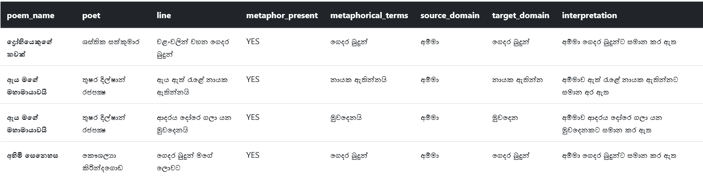

# SINPOMET (SINhala POem METaphors) Search App

This is a mini project done for CS4642 Data Mining module. SINPOMET is a search application for metaphors found in sinhala poems. Currently SINPOMET includes the following data:

-   poem_name
-   poet
-   line (poem line including the metaphor)
-   metaphorical_terms
-   source_domain
-   target_domain
-   interpretation

All the above information is provided in Sinhala. The current [corpus](https://github.com/nimanthadilz/sinhala-poem-metaphors-search-app/blob/main/corpus.csv) contains 75 metaphor instances found in sinhala poems (and there are some lines without metaphors, which can be found by referring to the `metaphor_present` boolean field).

## Setup

1. To setup this application in your local machine, few prequisites need to be setup.

    1. Install Elasticsearch (>=v8) and Kibana (>=v8).
    2. Install Node.js (>= v18).

    You can follow instructions provided [here](https://www.elastic.co/guide/en/elasticsearch/reference/current/run-elasticsearch-locally.html) to setup Elasticsearch and Kibana.

2. Clone the repo.

3. After, setting up Elasticsearch and Kibana, you need to load the `corpus.csv` file to Elasticsearch. You can use instructions provided [here](https://www.elastic.co/blog/importing-csv-and-log-data-into-elasticsearch-with-file-data-visualizer) to do that.

    You should create an index with all the fields of type `text`.

4. In order to add support for synonym filter, you should modify the settings of the index.

    1. First, copy the `synonyms.csv` file to the config directory of your Elasticsearch installation directory.
    2. Next, run the following requests in the Elasticsearch console (Management > Dev Tools > Console).

        ```
        POST /sinhala-poem-metaphors/_close
        ```

        ```
        PUT /sinhala-poem-metaphors/_settings
        {
            "settings": {
                "analysis": {
                    "analyzer": {
                        "syn_analyzer": {
                            "tokenizer": "standard",
                            "filter": [
                                "synonyms"
                            ]
                        }
                    },
                    "filter": {
                        "synonyms": {
                            "type": "synonym",
                            "synonyms_path": "synonyms.csv",
                            "updateable": true
                        }
                    }
                }
            }
        }
        ```

        ```
        POST /sinhala-poem-metaphors/_open
        ```

    These requests create an analyzer that can be used to search with synonyms.

5. Run `npm install` while inside the repository directory to install node dependencies.

6. Create a `.env` file inside the repo directory defining the `ES_URL` as below. `ES_URL` should point to the index you created in step 3.

    ```
    ES_URL=http://localhost:9200/sinahla-poem-metaphors
    ```

7. Run `npm start` to start the server.

8. Go to `localhost:3000` in your browser to view the frontend of the app.

## Querying

To query the corpus of data, you can use `query_string` type queries in Elasticsearch ([Read more](https://www.elastic.co/guide/en/elasticsearch/reference/current/query-dsl-query-string-query.html)). Enter the query in the textbox and press Enter or click the Search button.

To ease the process of querying, a synonym filter is added. When enabled (by ticking the checkbox in the UI), the user does not need to give the exact same word in the corpus. Even if a synonym is given, documents that have synonyms to that word will be returned in results.

For example, if a query like `source_domain:මව` is executed along with synonym filter enabled, it will match documents containing synonyms to `මව`. 


